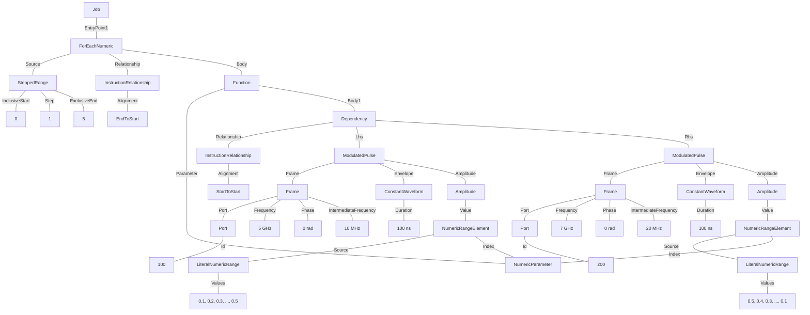

# Sweeping Parameters in the Same Loop
This example demonstrates the sweeping of two different parameters within the loop. In this case, the amplitudes of two parallel pulses are swept across independent `LiteralNumericRanges` in the same ForEach body. The ForEach sweeps over an index, and two `NumericRangeElement` expressions are used to get the values from the ranges at these indexes.

### Tree format:


### JSON format:
<details>
<summary>Job definition</summary>

``` JSON
{
    "version": "0.1.0",
    "compatible_version": "0.1.0",
    "numeric_parameters": {
        "NumericParameter1": {}
    },
    "entry_point": [
        {
            "$type": "ForEachNumeric",
            "source": {
                "$type": "SteppedRange",
                "inclusive_start": {
                    "$type": "NumericLiteral",
                    "value": 0
                },
                "step": {
                    "$type": "NumericLiteral",
                    "value": 1
                },
                "exclusive_end": {
                    "$type": "NumericLiteral",
                    "value": 5
                }
            },
            "relationship": {},
            "body_name": null,
            "parameter": {
                "$ref": "NumericParameter1"
            },
            "body_content": [
                {
                    "$type": "Dependency",
                    "relationship": {
                        "alignment": "StartToStart"
                    },
                    "lhs": {
                        "$type": "ModulatedPulse",
                        "frame": {
                            "port": {
                                "id": {
                                    "$type": "NumericLiteral",
                                    "value": 100
                                }
                            },
                            "frequency": {
                                "$type": "NumericLiteral",
                                "value": 5000000000
                            },
                            "phase": {
                                "$type": "NumericLiteral",
                                "value": 0
                            },
                            "intermediate_frequency": {
                                "$type": "NumericLiteral",
                                "value": 10000000
                            }
                        },
                        "envelope": {
                            "$type": "ConstantWaveform",
                            "duration": {
                                "$type": "NumericLiteral",
                                "value": 1E-07
                            }
                        },
                        "phase_offset": {
                            "$type": "NumericLiteral",
                            "value": 0
                        },
                        "amplitude": {
                            "$type": "NumericRangeElement",
                            "source": {
                                "$type": "LiteralNumericRange",
                                "values": [
                                    0.1,
                                    0.2,
                                    0.3,
                                    0.4,
                                    0.5
                                ]
                            },
                            "index": {
                                "$type": "NumericParameter",
                                "$ref": "NumericParameter1"
                            }
                        }
                    },
                    "rhs": {
                        "$type": "ModulatedPulse",
                        "frame": {
                            "port": {
                                "id": {
                                    "$type": "NumericLiteral",
                                    "value": 200
                                }
                            },
                            "frequency": {
                                "$type": "NumericLiteral",
                                "value": 7000000000
                            },
                            "phase": {
                                "$type": "NumericLiteral",
                                "value": 0
                            },
                            "intermediate_frequency": {
                                "$type": "NumericLiteral",
                                "value": 20000000
                            }
                        },
                        "envelope": {
                            "$type": "ConstantWaveform",
                            "duration": {
                                "$type": "NumericLiteral",
                                "value": 1E-07
                            }
                        },
                        "phase_offset": {
                            "$type": "NumericLiteral",
                            "value": 0
                        },
                        "amplitude": {
                            "$type": "NumericRangeElement",
                            "source": {
                                "$type": "LiteralNumericRange",
                                "values": [
                                    0.5,
                                    0.4,
                                    0.3,
                                    0.2,
                                    0.1
                                ]
                            },
                            "index": {
                                "$type": "NumericParameter",
                                "$ref": "NumericParameter1"
                            }
                        }
                    }
                }
            ]
        }
    ]
}
```
</details>
