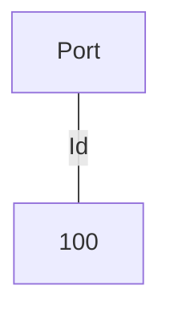
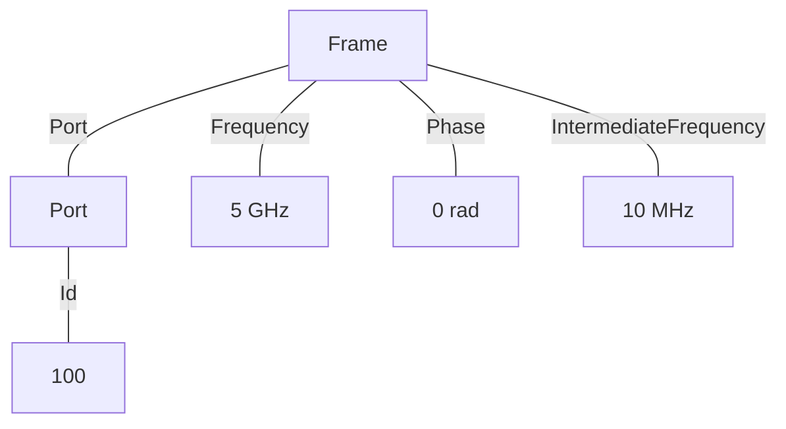
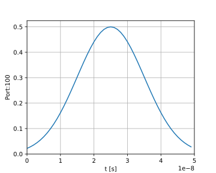
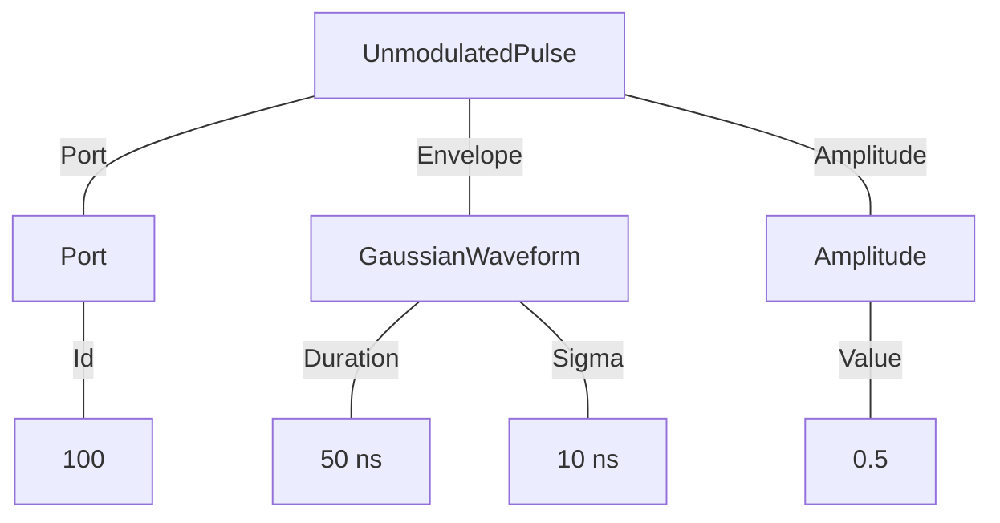
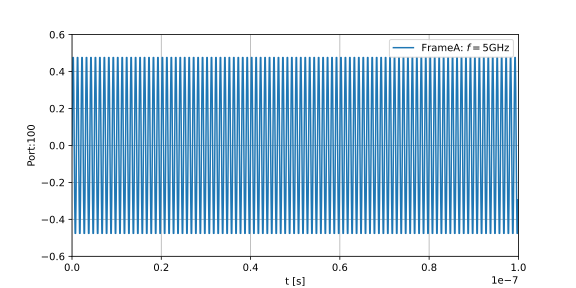
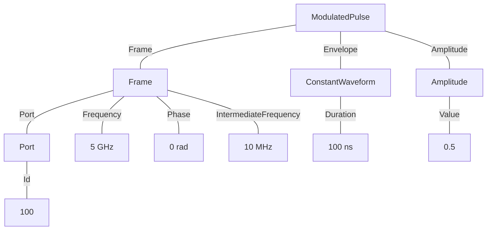

# Simple Programs
In this section we show some example implementations of the OAQ specification for some core concepts.

## Defining a Port
Ports are defined simply with a Port node and an ID value. Valid values for Ports should be declared in the backend documentation.

In this example a Port with an ID "100" is declared.

!!! note
    Since the tree below doesn't start with a Job node it is not by itself a valid AST, and is just meant as an example of declaring a Port.

### Tree format:



## Defining a Frame
A frame is defined by a frequency, phase and a Port the frame is to be played on. Optionally, an intermediate frequency can be specified to force that to be used by the backend.

In this example, a Frame of frequency 5 GHz and zero initial phase applied to port "100" is defined. Additionally an IF of 100 MHz is specified.

!!! note
    Since the tree below does't start with a Job node it is not by itself a valid AST, and is just meant as an example of declaring a Frame.

### Tree format:


## A single unmodulated pulse
In this example we declare a very simple job that consists of a single unmodulated Gaussian pulse to be played on port "100".

### Example schedule


### Tree format:


### JSON format:
<details>
<summary>Job definition</summary>

``` JSON
{
    "version": "0.1.0",
    "compatible_version": "0.1.0",
    "entry_point": [
        {
            "$type": "UnmodulatedPulse",
            "port": {
                "id": {
                    "$type": "NumericLiteral",
                    "value": 100
                }
            },
            "envelope": {
                "$type": "GaussianWaveform",
                "duration": {
                    "$type": "NumericLiteral",
                    "value": 5E-08
                },
                "sigma": {
                    "$type": "NumericLiteral",
                    "value": 1E-08
                }
            },
            "amplitude": {
                "$type": "NumericLiteral",
                "value": 0.5
            }
        }
    ]
}
```

</details>

## A single modulated pulse
In this example we declare a job that consists of a modulated constant waveform played on the frame defined earlier.

### Example schedule



### Tree format:

### JSON format:
<details>
<summary>Job definition</summary>

``` JSON
{
    "version": "0.1.0",
    "compatible_version": "0.1.0",
    "entry_point": [
        {
            "$type": "ModulatedPulse",
            "frame": {
                "port": {
                    "id": {
                        "$type": "NumericLiteral",
                        "value": 100
                    }
                },
                "frequency": {
                    "$type": "NumericLiteral",
                    "value": 5000000000
                },
                "phase": {
                    "$type": "NumericLiteral",
                    "value": 0
                },
                "intermediate_frequency": {
                    "$type": "NumericLiteral",
                    "value": 10000000
                }
            },
            "envelope": {
                "$type": "ConstantWaveform",
                "duration": {
                    "$type": "NumericLiteral",
                    "value": 1E-07
                }
            },
            "phase_offset": {
                "$type": "NumericLiteral",
                "value": 0
            },
            "amplitude": {
                "$type": "NumericLiteral",
                "value": 0.5
            }
        }
    ]
}
```
</details>
