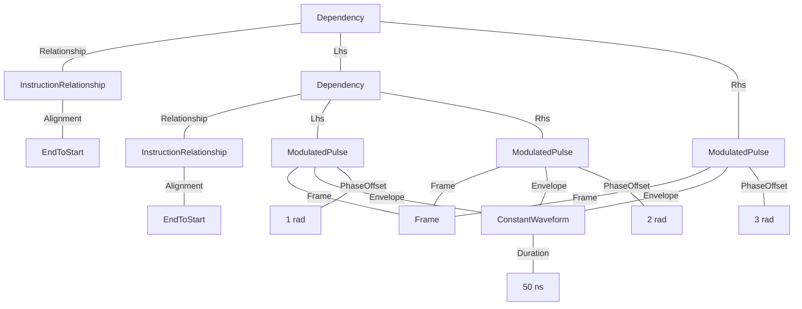
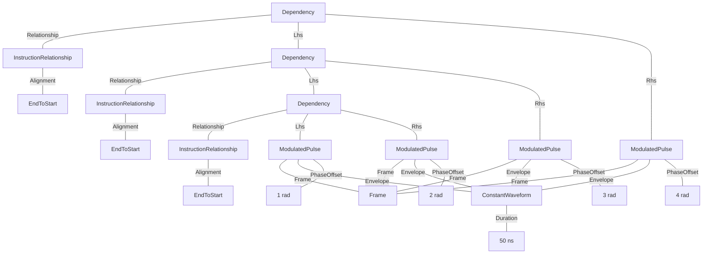
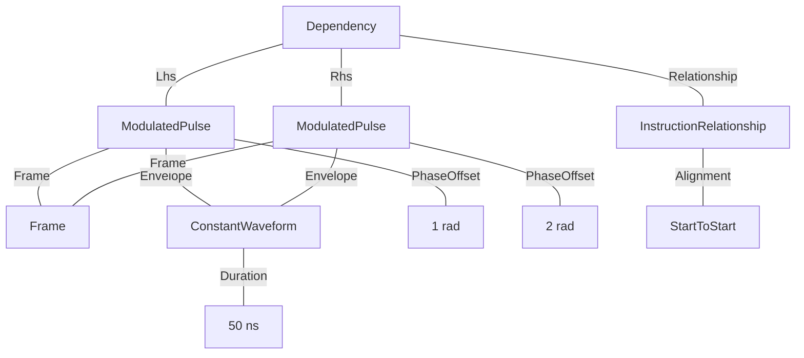
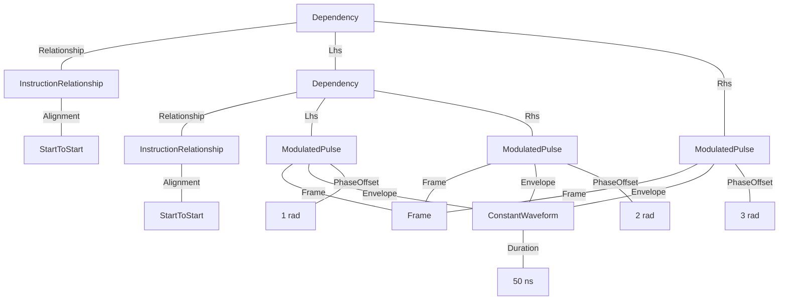
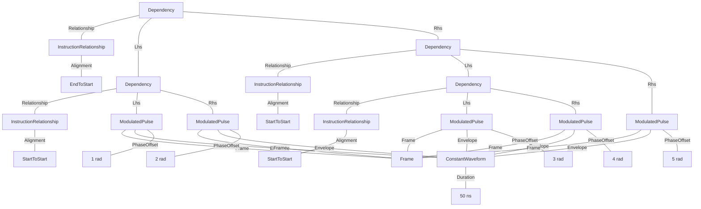
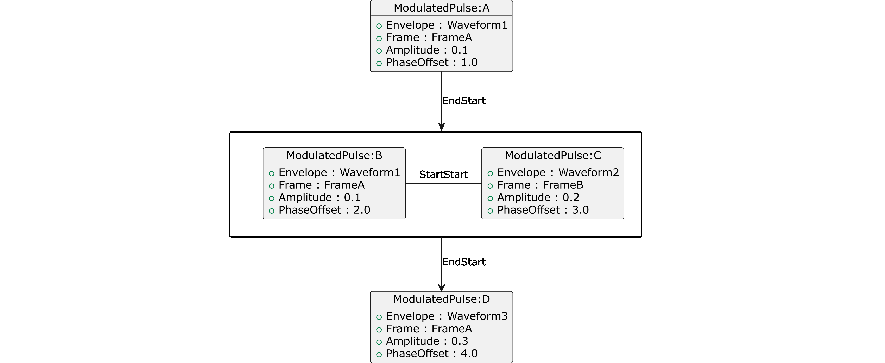
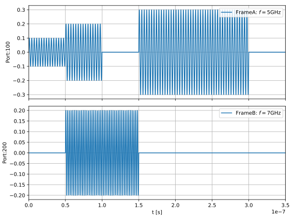
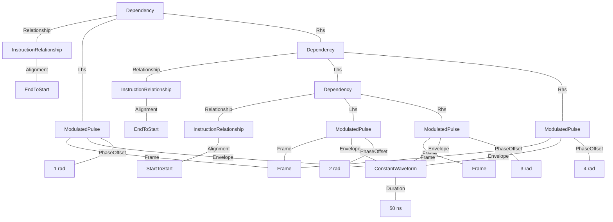

## Dependencies and dependency chains
When defining jobs with more than one instruction, dependencies must be specified to declare how one instruction should depend on another in time.

The simplest example is two instructions, the second of which starts when the first one completes.
(A | B)


Because, like drive instructions, Dependencies inherit from Instruction, they themselves can be fields in another dependency, i.e. one can declare a dependency between two other dependencies or a dependency and another instruction. This enables three instructions to be chained.
(A | B | C)



While more complex arrangements are possible, the normal way to create sequences of multiple instructions is to create a left-heavy tree. An unbalanced tree may seem inefficient to someone unfamiliar with ASTs but is actually normal.
(A | B | C | D)



All the above examples use a end-start pulse edge alignment where one instruction sequentially follows the other. Currently, a user can specify either this end-start pulse edge alignment or a start-start alignment where two pulses are played in parallel.
(A / B)



Similarly to sequential chains, multiple instructions that start at the same time tend to be represented by left-heavy trees.
(A / B / C)



Barrier instructions in other paradigms would be represented by an end-to-start dependency between trees of instructions linked by start-to-start dependencies as in the following example.
((A / B) | (C / D / E))



The next example is more complex, we realize a set of four instructions with order dependencies as shown by the graph below, including both EndToStart and StartToStart alignments.



The example also flags another feature of the specification where some nodes can be children of more than one parent. In this case, instructions A, B & D use the same Frame, and instructions A & B use the same waveform (with a different amplitude).

### Example schedule


### Tree format:


### JSON format:
<details>
<summary>Job definition</summary>

``` JSON
{
    "version": "0.1.0",
    "compatible_version": "0.1.0",
    "frames": {
        "Frame1": {
            "port": {
                "id": {
                    "$type": "NumericLiteral",
                    "value": 100
                }
            },
            "frequency": {
                "$type": "NumericLiteral",
                "value": 5000000000
            },
            "phase": {
                "$type": "NumericLiteral",
                "value": 0
            },
            "intermediate_frequency": {
                "$type": "NumericLiteral",
                "value": 10000000
            }
        }
    },
    "waveforms": {
        "Waveform1": {
            "$type": "ConstantWaveform",
            "duration": {
                "$type": "NumericLiteral",
                "value": 5E-08
            }
        }
    },
    "entry_point": [
        {
            "$type": "Dependency",
            "relationship": {},
            "lhs": {
                "$type": "ModulatedPulse",
                "frame": {
                    "$ref": "Frame1"
                },
                "envelope": {
                    "$ref": "Waveform1"
                },
                "phase_offset": {
                    "$type": "NumericLiteral",
                    "value": 1
                },
                "amplitude": {
                    "$type": "NumericLiteral",
                    "value": 1
                }
            },
            "rhs": {
                "$type": "Dependency",
                "relationship": {},
                "lhs": {
                    "$type": "Dependency",
                    "relationship": {
                        "alignment": "StartToStart"
                    },
                    "lhs": {
                        "$type": "ModulatedPulse",
                        "frame": {
                            "$ref": "Frame1"
                        },
                        "envelope": {
                            "$ref": "Waveform1"
                        },
                        "phase_offset": {
                            "$type": "NumericLiteral",
                            "value": 2
                        },
                        "amplitude": {
                            "$type": "NumericLiteral",
                            "value": 1
                        }
                    },
                    "rhs": {
                        "$type": "ModulatedPulse",
                        "frame": {
                            "port": {
                                "id": {
                                    "$type": "NumericLiteral",
                                    "value": 200
                                }
                            },
                            "frequency": {
                                "$type": "NumericLiteral",
                                "value": 7000000000
                            },
                            "phase": {
                                "$type": "NumericLiteral",
                                "value": 0
                            },
                            "intermediate_frequency": {
                                "$type": "NumericLiteral",
                                "value": 20000000
                            }
                        },
                        "envelope": {
                            "$ref": "Waveform1"
                        },
                        "phase_offset": {
                            "$type": "NumericLiteral",
                            "value": 3
                        },
                        "amplitude": {
                            "$type": "NumericLiteral",
                            "value": 1
                        }
                    }
                },
                "rhs": {
                    "$type": "ModulatedPulse",
                    "frame": {
                        "$ref": "Frame1"
                    },
                    "envelope": {
                        "$ref": "Waveform1"
                    },
                    "phase_offset": {
                        "$type": "NumericLiteral",
                        "value": 4
                    },
                    "amplitude": {
                        "$type": "NumericLiteral",
                        "value": 1
                    }
                }
            }
        }
    ]
}
```
</details>
