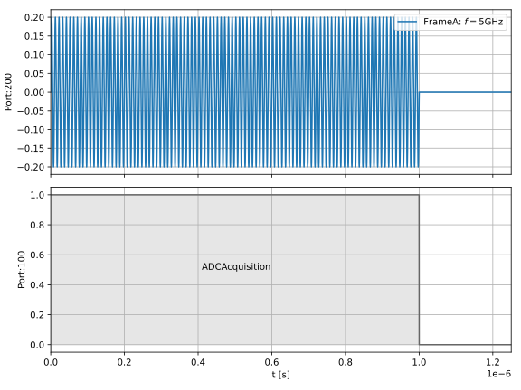
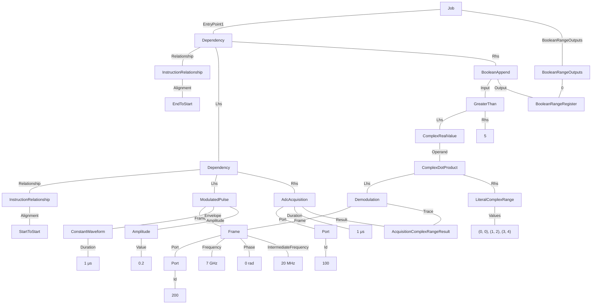

# A readout operation
In this example we define a readout operation consisting of a $1 \mu s$ constant pulse played on the readout drive port "200" and an ADC acquisition played on the acquisition port "100" in parallel for the same duration. The trace captured by the acquisition goes through the following post processing:

* Demodulation via an explicit Demodulation expression with a specified Frame.
* Integration via a ComplexDotProduct with a set of complex weights.
* Classification with a Comparison operator, setting to true if the demodulated value is greater than 5 and false otherwise. 

The classified value is then appended to a BooleanRangeRegister, and finally, the Register is specified as one of the job outputs with the name "classified_values" so that it will be returned to the user on job completion.

Note the matched min and max offsets specified for the drive/acquisition instruction relationship to ensure that the backend plays them at exactly the same time.

Below we also include the example JSON Results object that may be returned by running this Job.

### Example schedule



### Tree format:


### JSON format:
<details>
<summary>Job definition</summary>

``` JSON
{
    "version": "0.1.0",
    "compatible_version": "0.1.0",
    "boolean_range_registers": {
        "BooleanRangeRegister1": {
            "output_name": "classified_values"
        }
    },
    "acquisition_complex_range_results": {
        "AcquisitionComplexRangeResult1": {}
    },
    "frames": {
        "Frame1": {
            "port": {
                "id": {
                    "$type": "NumericLiteral",
                    "value": 200
                }
            },
            "frequency": {
                "$type": "NumericLiteral",
                "value": 7000000000
            },
            "phase": {
                "$type": "NumericLiteral",
                "value": 0
            },
            "intermediate_frequency": {
                "$type": "NumericLiteral",
                "value": 20000000
            }
        }
    },
    "entry_point": [
        {
            "$type": "Dependency",
            "relationship": {},
            "lhs": {
                "$type": "Dependency",
                "relationship": {
                    "alignment": "StartToStart"
                },
                "lhs": {
                    "$type": "ModulatedPulse",
                    "frame": {
                        "$ref": "Frame1"
                    },
                    "envelope": {
                        "$type": "ConstantWaveform",
                        "duration": {
                            "$type": "NumericLiteral",
                            "value": 1E-06
                        }
                    },
                    "phase_offset": {
                        "$type": "NumericLiteral",
                        "value": 0
                    },
                    "amplitude": {
                        "$type": "NumericLiteral",
                        "value": 0.2
                    }
                },
                "rhs": {
                    "$type": "AdcAcquisition",
                    "port": {
                        "id": {
                            "$type": "NumericLiteral",
                            "value": 100
                        }
                    },
                    "duration": {
                        "$type": "NumericLiteral",
                        "value": 1E-06
                    },
                    "result": {
                        "$ref": "AcquisitionComplexRangeResult1"
                    }
                }
            },
            "rhs": {
                "$type": "BooleanAppend",
                "input": {
                    "$type": "ComparisonOperation",
                    "operator": "GreaterThan",
                    "lhs": {
                        "$type": "ComplexRealValue",
                        "operand": {
                            "$type": "ComplexDotProduct",
                            "lhs": {
                                "$type": "Demodulation",
                                "frame": {
                                    "$ref": "Frame1"
                                },
                                "trace": {
                                    "$ref": "AcquisitionComplexRangeResult1"
                                }
                            },
                            "rhs": {
                                "$type": "LiteralComplexRange",
                                "values": [
                                    [
                                        0,
                                        0
                                    ],
                                    [
                                        1,
                                        2
                                    ],
                                    [
                                        3,
                                        4
                                    ]
                                ]
                            }
                        }
                    },
                    "rhs": {
                        "$type": "NumericLiteral",
                        "value": 5
                    }
                },
                "output": {
                    "$ref": "BooleanRangeRegister1"
                }
            }
        }
    ]
}
```
</details>

<details>
<summary>Example results</summary>

``` JSON

{
    "version": "0.1.0",
    "compatible_version": "0.1.0",
    "boolean_range_results": [
        {
            "name": "classified_values",
            "value": [false, true, true, false, ...]
        }
    ],
}
```
</details>
