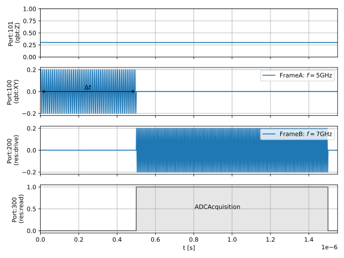

# A time-Rabi experiment
In this example we perform Rabi oscillations on a qubit by driving a qubit for some duration, and performing readout immediately after.
* We iterate over the duration of the qubit pulse from 0-1 us in steps of 10 ns.
* To get some statistics we repeat each step of the program 1000 times with an inner for loop.
* The readout trace is demodulated, but not classified.
* Between repetitions, the qubit is passively reset with a 1 ms delay.
* A DC bias of 0.3 V is applied to the qubit Z port "101" at the start of the program.
* Each set of 1000 repetitions are averaged before they are returned to the user.

#### Averaging:
Averaging is handled by applying a ComplexAverageOver expression to the register holding the raw results, with additional arguments specifying:

* How to reshape the data ([100, 1000] corresponding to the nested for loop dimensions).
* Which axis index to average over (1, the innermost axis).

The results of the averaging operation are loaded into a second ComplexRangeRegister via a ComplexRangeAssign instruction. This second register is saved as an output.

### Example schedule



### Tree format:

```mermaid
graph TD
    NumericExpression1["101"]
    Port1["Port"]
    Port1 -- "Id" --- NumericExpression1
    NumericExpression2["0.3"]
    Amplitude1["Amplitude"]
    Amplitude1 -- "Value" --- NumericExpression2
    Instruction3["DcBias"]
    Instruction3 -- "Port" --- Port1
    Instruction3 -- "Amplitude" --- Amplitude1
    NumericExpression3["0"]
    NumericExpression4["1E-08"]
    NumericExpression5["1E-06"]
    NumericRange1["SteppedRange"]
    NumericRange1 -- "InclusiveStart" --- NumericExpression3
    NumericRange1 -- "Step" --- NumericExpression4
    NumericRange1 -- "ExclusiveEnd" --- NumericExpression5
    NumericParameter1["NumericParameter"]
    NumericExpression6["0"]
    NumericExpression7["1"]
    NumericExpression8["1000"]
    NumericRange2["SteppedRange"]
    NumericRange2 -- "InclusiveStart" --- NumericExpression6
    NumericRange2 -- "Step" --- NumericExpression7
    NumericRange2 -- "ExclusiveEnd" --- NumericExpression8
    NumericParameter2["NumericParameter"]
    Interval2["1 ms"]
    Instruction7["Delay"]
    Instruction7 -- "Duration" --- Interval2
    NumericExpression9["100"]
    Port2["Port"]
    Port2 -- "Id" --- NumericExpression9
    Frequency3["5 GHz"]
    Radians4["0 rad"]
    Frequency5["10 MHz"]
    Frame1["Frame"]
    Frame1 -- "Port" --- Port2
    Frame1 -- "Frequency" --- Frequency3
    Frame1 -- "Phase" --- Radians4
    Frame1 -- "IntermediateFrequency" --- Frequency5
    Seconds6["Seconds"]
    Seconds6 -- "Value" --- NumericParameter1
    Waveform1["ConstantWaveform"]
    Waveform1 -- "Duration" --- Seconds6
    Instruction9["ModulatedPulse"]
    Instruction9 -- "Frame" --- Frame1
    Instruction9 -- "Envelope" --- Waveform1
    NumericExpression10["0.1"]
    Amplitude7["Amplitude"]
    Amplitude7 -- "Value" --- NumericExpression10
    Instruction9 -- "Amplitude" --- Amplitude7
    NumericExpression11["200"]
    Port3["Port"]
    Port3 -- "Id" --- NumericExpression11
    Frequency8["7 GHz"]
    Radians9["0 rad"]
    Frequency10["20 MHz"]
    Frame2["Frame"]
    Frame2 -- "Port" --- Port3
    Frame2 -- "Frequency" --- Frequency8
    Frame2 -- "Phase" --- Radians9
    Frame2 -- "IntermediateFrequency" --- Frequency10
    Interval11["1 μs"]
    Waveform2["ConstantWaveform"]
    Waveform2 -- "Duration" --- Interval11
    Instruction12["ModulatedPulse"]
    Instruction12 -- "Frame" --- Frame2
    Instruction12 -- "Envelope" --- Waveform2
    NumericExpression12["0.2"]
    Amplitude12["Amplitude"]
    Amplitude12 -- "Value" --- NumericExpression12
    Instruction12 -- "Amplitude" --- Amplitude12
    NumericExpression13["300"]
    Port4["Port"]
    Port4 -- "Id" --- NumericExpression13
    Interval13["1 μs"]
    ComplexRangeExpression1["AcquisitionComplexRangeResult"]
    Instruction13["AdcAcquisition"]
    Instruction13 -- "Port" --- Port4
    Instruction13 -- "Duration" --- Interval13
    Instruction13 -- "Result" --- ComplexRangeExpression1
    Instruction14:Alignment["StartToStart"]
    Instruction14:Relationship["InstructionRelationship"]
    Instruction14:Relationship -- "Alignment" --- Instruction14:Alignment
    Instruction14["Dependency"]
    Instruction14 -- "Relationship" --- Instruction14:Relationship
    Instruction14 -- "Lhs" --- Instruction12
    Instruction14 -- "Rhs" --- Instruction13
    ComplexRangeExpression2:Values["(0, 1), (2, 3), (4, 5), ..., (1998, 1999)"]
    ComplexRangeExpression2["LiteralComplexRange"]
    ComplexRangeExpression2 -- "Values" --- ComplexRangeExpression2:Values
    ComplexExpression1["ComplexDotProduct"]
    ComplexExpression1 -- "Lhs" --- ComplexRangeExpression1
    ComplexExpression1 -- "Rhs" --- ComplexRangeExpression2
    ComplexRangeRegister1["ComplexRangeRegister"]
    Instruction15["ComplexAppend"]
    Instruction15 -- "Input" --- ComplexExpression1
    Instruction15 -- "Output" --- ComplexRangeRegister1
    Instruction16:Alignment["EndToStart"]
    Instruction16:Relationship["InstructionRelationship"]
    Instruction16:Relationship -- "Alignment" --- Instruction16:Alignment
    Instruction16["Dependency"]
    Instruction16 -- "Relationship" --- Instruction16:Relationship
    Instruction16 -- "Lhs" --- Instruction14
    Instruction16 -- "Rhs" --- Instruction15
    Instruction17:Alignment["EndToStart"]
    Instruction17:Relationship["InstructionRelationship"]
    Instruction17:Relationship -- "Alignment" --- Instruction17:Alignment
    Instruction17["Dependency"]
    Instruction17 -- "Relationship" --- Instruction17:Relationship
    Instruction17 -- "Lhs" --- Instruction9
    Instruction17 -- "Rhs" --- Instruction16
    Instruction18:Alignment["EndToStart"]
    Instruction18:Relationship["InstructionRelationship"]
    Instruction18:Relationship -- "Alignment" --- Instruction18:Alignment
    Instruction18["Dependency"]
    Instruction18 -- "Relationship" --- Instruction18:Relationship
    Instruction18 -- "Lhs" --- Instruction7
    Instruction18 -- "Rhs" --- Instruction17
    Instruction19:Alignment["EndToStart"]
    Instruction19:Relationship["InstructionRelationship"]
    Instruction19:Relationship -- "Alignment" --- Instruction19:Alignment
    Function20["Function"]
    Function20 -- "Parameter" --- NumericParameter2
    Function20 -- "Body1" --- Instruction18
    Instruction19["ForEachNumeric"]
    Instruction19 -- "Source" --- NumericRange2
    Instruction19 -- "Relationship" --- Instruction19:Relationship
    Instruction19 -- "Body" --- Function20
    Instruction21:Alignment["EndToStart"]
    Instruction21:Relationship["InstructionRelationship"]
    Instruction21:Relationship -- "Alignment" --- Instruction21:Alignment
    Function22["Function"]
    Function22 -- "Parameter" --- NumericParameter1
    Function22 -- "Body1" --- Instruction19
    Instruction21["ForEachNumeric"]
    Instruction21 -- "Source" --- NumericRange1
    Instruction21 -- "Relationship" --- Instruction21:Relationship
    Instruction21 -- "Body" --- Function22
    Instruction23:Alignment["EndToStart"]
    Instruction23:Relationship["InstructionRelationship"]
    Instruction23:Relationship -- "Alignment" --- Instruction23:Alignment
    Instruction23["Dependency"]
    Instruction23 -- "Relationship" --- Instruction23:Relationship
    Instruction23 -- "Lhs" --- Instruction3
    Instruction23 -- "Rhs" --- Instruction21
    ComplexRangeExpression3:BufferDimensions["100, 1000"]
    ComplexRangeExpression3["ComplexAverageOver"]
    ComplexRangeExpression3 -- "Source" --- ComplexRangeRegister1
    ComplexRangeExpression3 -- "BufferDimensions" --- ComplexRangeExpression3:BufferDimensions
    ComplexRangeExpression3 -- "AveragingAxis" --- 1
    ComplexRangeRegister2["ComplexRangeRegister"]
    Instruction24["ComplexAssign"]
    Instruction24 -- "Input" --- ComplexRangeExpression3
    Instruction24 -- "Output" --- ComplexRangeRegister2
    Instruction25:Alignment["EndToStart"]
    Instruction25:Relationship["InstructionRelationship"]
    Instruction25:Relationship -- "Alignment" --- Instruction25:Alignment
    Instruction25["Dependency"]
    Instruction25 -- "Relationship" --- Instruction25:Relationship
    Instruction25 -- "Lhs" --- Instruction23
    Instruction25 -- "Rhs" --- Instruction24
    Job:ComplexRangeOutputs["ComplexRangeOutputs"]
    Job:ComplexRangeOutputs -- "0" --- ComplexRangeRegister2
    Job["Job"]
    Job -- "EntryPoint1" --- Instruction25
    Job -- "ComplexRangeOutputs" --- Job:ComplexRangeOutputs
```


### JSON format:
<details>
<summary>Job definition</summary>

``` JSON
{
    "version": "0.1.0",
    "compatible_version": "0.1.0",
    "complex_range_registers": {
        "ComplexRangeRegister1": {
            "output_name": null
        },
        "ComplexRangeRegister2": {
            "output_name": "rabi_vals"
        }
    },
    "numeric_parameters": {
        "NumericParameter1": {}
    },
    "acquisition_complex_range_results": {
        "AcquisitionComplexRangeResult1": {}
    },
    "entry_point": [
        {
            "$type": "Dependency",
            "relationship": {},
            "lhs": {
                "$type": "Dependency",
                "relationship": {},
                "lhs": {
                    "$type": "DcBias",
                    "port": {
                        "id": {
                            "$type": "NumericLiteral",
                            "value": 101
                        }
                    },
                    "amplitude": {
                        "$type": "NumericLiteral",
                        "value": 0.3
                    }
                },
                "rhs": {
                    "$type": "ForEachNumeric",
                    "source": {
                        "$type": "SteppedRange",
                        "inclusive_start": {
                            "$type": "NumericLiteral",
                            "value": 0
                        },
                        "step": {
                            "$type": "NumericLiteral",
                            "value": 1E-08
                        },
                        "exclusive_end": {
                            "$type": "NumericLiteral",
                            "value": 1E-06
                        }
                    },
                    "relationship": {},
                    "body_name": null,
                    "parameter": {
                        "$ref": "NumericParameter1"
                    },
                    "body_content": [
                        {
                            "$type": "ForEachNumeric",
                            "source": {
                                "$type": "SteppedRange",
                                "inclusive_start": {
                                    "$type": "NumericLiteral",
                                    "value": 0
                                },
                                "step": {
                                    "$type": "NumericLiteral",
                                    "value": 1
                                },
                                "exclusive_end": {
                                    "$type": "NumericLiteral",
                                    "value": 1000
                                }
                            },
                            "relationship": {},
                            "body_name": null,
                            "parameter": {},
                            "body_content": [
                                {
                                    "$type": "Dependency",
                                    "relationship": {},
                                    "lhs": {
                                        "$type": "Delay",
                                        "duration": {
                                            "$type": "NumericLiteral",
                                            "value": 0.001
                                        }
                                    },
                                    "rhs": {
                                        "$type": "Dependency",
                                        "relationship": {},
                                        "lhs": {
                                            "$type": "ModulatedPulse",
                                            "frame": {
                                                "port": {
                                                    "id": {
                                                        "$type": "NumericLiteral",
                                                        "value": 100
                                                    }
                                                },
                                                "frequency": {
                                                    "$type": "NumericLiteral",
                                                    "value": 5000000000
                                                },
                                                "phase": {
                                                    "$type": "NumericLiteral",
                                                    "value": 0
                                                },
                                                "intermediate_frequency": {
                                                    "$type": "NumericLiteral",
                                                    "value": 10000000
                                                }
                                            },
                                            "envelope": {
                                                "$type": "ConstantWaveform",
                                                "duration": {
                                                    "$type": "NumericParameter",
                                                    "$ref": "NumericParameter1"
                                                }
                                            },
                                            "phase_offset": {
                                                "$type": "NumericLiteral",
                                                "value": 0
                                            },
                                            "amplitude": {
                                                "$type": "NumericLiteral",
                                                "value": 0.1
                                            }
                                        },
                                        "rhs": {
                                            "$type": "Dependency",
                                            "relationship": {},
                                            "lhs": {
                                                "$type": "Dependency",
                                                "relationship": {
                                                    "alignment": "StartToStart"
                                                },
                                                "lhs": {
                                                    "$type": "ModulatedPulse",
                                                    "frame": {
                                                        "port": {
                                                            "id": {
                                                                "$type": "NumericLiteral",
                                                                "value": 200
                                                            }
                                                        },
                                                        "frequency": {
                                                            "$type": "NumericLiteral",
                                                            "value": 7000000000
                                                        },
                                                        "phase": {
                                                            "$type": "NumericLiteral",
                                                            "value": 0
                                                        },
                                                        "intermediate_frequency": {
                                                            "$type": "NumericLiteral",
                                                            "value": 20000000
                                                        }
                                                    },
                                                    "envelope": {
                                                        "$type": "ConstantWaveform",
                                                        "duration": {
                                                            "$type": "NumericLiteral",
                                                            "value": 1E-06
                                                        }
                                                    },
                                                    "phase_offset": {
                                                        "$type": "NumericLiteral",
                                                        "value": 0
                                                    },
                                                    "amplitude": {
                                                        "$type": "NumericLiteral",
                                                        "value": 0.2
                                                    }
                                                },
                                                "rhs": {
                                                    "$type": "AdcAcquisition",
                                                    "port": {
                                                        "id": {
                                                            "$type": "NumericLiteral",
                                                            "value": 300
                                                        }
                                                    },
                                                    "duration": {
                                                        "$type": "NumericLiteral",
                                                        "value": 1E-06
                                                    },
                                                    "result": {
                                                        "$ref": "AcquisitionComplexRangeResult1"
                                                    }
                                                }
                                            },
                                            "rhs": {
                                                "$type": "ComplexAppend",
                                                "input": {
                                                    "$type": "ComplexDotProduct",
                                                    "lhs": {
                                                        "$type": "AcquisitionComplexRangeResult",
                                                        "$ref": "AcquisitionComplexRangeResult1"
                                                    },
                                                    "rhs": {
                                                        "$type": "LiteralComplexRange",
                                                        "values": [
                                                            [
                                                                0,
                                                                1
                                                            ],
                                                            [
                                                                2,
                                                                3
                                                        
 ],                                                        [
                                                                1998,
                                                                1999
                                                            ]
                                                        ]
                                                    }
                                                },
                                                "output": {
                                                    "$ref": "ComplexRangeRegister1"
                                                }
                                            }
                                        }
                                    }
                                }
                            ]
                        }
                    ]
                }
            },
            "rhs": {
                "$type": "ComplexRangeAssign",
                "input": {
                    "$type": "ComplexAverageOver",
                    "source": {
                        "$type": "ComplexRangeRegister",
                        "$ref": "ComplexRangeRegister1"
                    },
                    "buffer_dimensions": [
                        100,
                        1000
                    ],
                    "averaging_axis": 1
                },
                "output": {
                    "$ref": "ComplexRangeRegister2"
                }
            }
        }
    ]
}
```
</details>


<details>
<summary>Example results</summary>

``` JSON

{
    "version": "0.1.0",
    "compatible_version": "0.1.0",
    "complex_range_results": [
        {
            "name": "rabi_vals",
            "value": [[4, 0], [5, 0.2], [9, 103], ...]
        }
    ]
}
```
</details>
