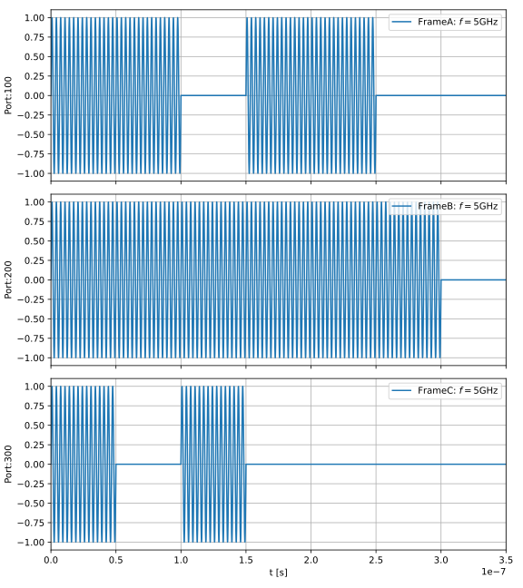

``` mermaid
graph TD
    Frame1["Frame"]
    Interval1["100 ns"]
    Waveform1["ConstantWaveform"]
    Waveform1 -- "Duration" --- Interval1
    Instruction2["ModulatedPulse"]
    Instruction2 -- "Frame" --- Frame1
    Instruction2 -- "Envelope" --- Waveform1
    Radians2["1 rad"]
    Instruction2 -- "PhaseOffset" --- Radians2
    Instruction3["ModulatedPulse"]
    Instruction3 -- "Frame" --- Frame1
    Instruction3 -- "Envelope" --- Waveform1
    Radians3["1 rad"]
    Instruction3 -- "PhaseOffset" --- Radians3
    Instruction4:Alignment["EndToStart"]
    Instruction4:Relationship["InstructionRelationship"]
    Instruction4:Relationship -- "Alignment" --- Instruction4:Alignment
    Instruction4["Dependency"]
    Instruction4 -- "Relationship" --- Instruction4:Relationship
    Instruction4 -- "Lhs" --- Instruction2
    Instruction4 -- "Rhs" --- Instruction3
    Frame2["Frame"]
    Interval4["150 ns"]
    Waveform2["ConstantWaveform"]
    Waveform2 -- "Duration" --- Interval4
    Instruction6["ModulatedPulse"]
    Instruction6 -- "Frame" --- Frame2
    Instruction6 -- "Envelope" --- Waveform2
    Radians5["2 rad"]
    Instruction6 -- "PhaseOffset" --- Radians5
    Instruction7["ModulatedPulse"]
    Instruction7 -- "Frame" --- Frame2
    Instruction7 -- "Envelope" --- Waveform2
    Radians6["2 rad"]
    Instruction7 -- "PhaseOffset" --- Radians6
    Instruction8:Alignment["EndToStart"]
    Instruction8:Relationship["InstructionRelationship"]
    Instruction8:Relationship -- "Alignment" --- Instruction8:Alignment
    Instruction8["Dependency"]
    Instruction8 -- "Relationship" --- Instruction8:Relationship
    Instruction8 -- "Lhs" --- Instruction6
    Instruction8 -- "Rhs" --- Instruction7
    Frame3["Frame"]
    Interval7["50 ns"]
    Waveform3["ConstantWaveform"]
    Waveform3 -- "Duration" --- Interval7
    Instruction10["ModulatedPulse"]
    Instruction10 -- "Frame" --- Frame3
    Instruction10 -- "Envelope" --- Waveform3
    Radians8["3 rad"]
    Instruction10 -- "PhaseOffset" --- Radians8
    Instruction11["ModulatedPulse"]
    Instruction11 -- "Frame" --- Frame3
    Instruction11 -- "Envelope" --- Waveform3
    Radians9["3 rad"]
    Instruction11 -- "PhaseOffset" --- Radians9
    Instruction12:Alignment["EndToStart"]
    Instruction12:Relationship["InstructionRelationship"]
    Instruction12:Relationship -- "Alignment" --- Instruction12:Alignment
    Instruction12["Dependency"]
    Instruction12 -- "Relationship" --- Instruction12:Relationship
    Instruction12 -- "Lhs" --- Instruction10
    Instruction12 -- "Rhs" --- Instruction11
    Instruction14["ModulatedPulse"]
    Instruction14 -- "Frame" --- Frame1
    Instruction14 -- "Envelope" --- Waveform1
    Radians10["1 rad"]
    Instruction14 -- "PhaseOffset" --- Radians10
    Instruction15["ModulatedPulse"]
    Instruction15 -- "Frame" --- Frame2
    Instruction15 -- "Envelope" --- Waveform2
    Radians11["2 rad"]
    Instruction15 -- "PhaseOffset" --- Radians11
    Instruction16:Alignment["EndToStart"]
    Instruction16:Relationship["InstructionRelationship"]
    Instruction16:Relationship -- "Alignment" --- Instruction16:Alignment
    Instruction16["Dependency"]
    Instruction16 -- "Relationship" --- Instruction16:Relationship
    Instruction16 -- "Lhs" --- Instruction14
    Instruction16 -- "Rhs" --- Instruction15
    Instruction18["ModulatedPulse"]
    Instruction18 -- "Frame" --- Frame2
    Instruction18 -- "Envelope" --- Waveform2
    Radians12["2 rad"]
    Instruction18 -- "PhaseOffset" --- Radians12
    Instruction19["ModulatedPulse"]
    Instruction19 -- "Frame" --- Frame1
    Instruction19 -- "Envelope" --- Waveform1
    Radians13["1 rad"]
    Instruction19 -- "PhaseOffset" --- Radians13
    Instruction20:Alignment["EndToStart"]
    Instruction20:Relationship["InstructionRelationship"]
    Instruction20:Relationship -- "Alignment" --- Instruction20:Alignment
    Instruction20["Dependency"]
    Instruction20 -- "Relationship" --- Instruction20:Relationship
    Instruction20 -- "Lhs" --- Instruction18
    Instruction20 -- "Rhs" --- Instruction19
    Instruction22["ModulatedPulse"]
    Instruction22 -- "Frame" --- Frame1
    Instruction22 -- "Envelope" --- Waveform1
    Radians14["1 rad"]
    Instruction22 -- "PhaseOffset" --- Radians14
    Instruction23["ModulatedPulse"]
    Instruction23 -- "Frame" --- Frame3
    Instruction23 -- "Envelope" --- Waveform3
    Radians15["3 rad"]
    Instruction23 -- "PhaseOffset" --- Radians15
    Instruction24:Alignment["EndToStart"]
    Instruction24:Relationship["InstructionRelationship"]
    Instruction24:Relationship -- "Alignment" --- Instruction24:Alignment
    Instruction24["Dependency"]
    Instruction24 -- "Relationship" --- Instruction24:Relationship
    Instruction24 -- "Lhs" --- Instruction22
    Instruction24 -- "Rhs" --- Instruction23
    Instruction26["ModulatedPulse"]
    Instruction26 -- "Frame" --- Frame3
    Instruction26 -- "Envelope" --- Waveform3
    Radians16["3 rad"]
    Instruction26 -- "PhaseOffset" --- Radians16
    Instruction27["ModulatedPulse"]
    Instruction27 -- "Frame" --- Frame1
    Instruction27 -- "Envelope" --- Waveform1
    Radians17["1 rad"]
    Instruction27 -- "PhaseOffset" --- Radians17
    Instruction28:Alignment["EndToStart"]
    Instruction28:Relationship["InstructionRelationship"]
    Instruction28:Relationship -- "Alignment" --- Instruction28:Alignment
    Instruction28["Dependency"]
    Instruction28 -- "Relationship" --- Instruction28:Relationship
    Instruction28 -- "Lhs" --- Instruction26
    Instruction28 -- "Rhs" --- Instruction27
    Job["Job"]
    Job -- "EntryPoint[0]" --- Instruction4
    Job -- "EntryPoint[1]" --- Instruction8
    Job -- "EntryPoint[2]" --- Instruction12
    Job -- "EntryPoint[3]" --- Instruction16
    Job -- "EntryPoint[4]" --- Instruction20
    Job -- "EntryPoint[5]" --- Instruction24
    Job -- "EntryPoint[6]" --- Instruction28
```

``` mermaid
graph TD
    Frame1["Frame"]
    Interval1["100 ns"]
    Waveform1["ConstantWaveform"]
    Waveform1 -- "Duration" --- Interval1
    Instruction3["ModulatedPulse"]
    Instruction3 -- "Frame" --- Frame1
    Instruction3 -- "Envelope" --- Waveform1
    Radians2["1 rad"]
    Instruction3 -- "PhaseOffset" --- Radians2
    Frame2["Frame"]
    Interval3["150 ns"]
    Waveform2["ConstantWaveform"]
    Waveform2 -- "Duration" --- Interval3
    Instruction4["ModulatedPulse"]
    Instruction4 -- "Frame" --- Frame2
    Instruction4 -- "Envelope" --- Waveform2
    Radians4["2 rad"]
    Instruction4 -- "PhaseOffset" --- Radians4
    Instruction5:Alignment["StartToStart"]
    Instruction5:Relationship["InstructionRelationship"]
    Instruction5:Relationship -- "Alignment" --- Instruction5:Alignment
    Instruction5["Dependency"]
    Instruction5 -- "Relationship" --- Instruction5:Relationship
    Instruction5 -- "Lhs" --- Instruction3
    Instruction5 -- "Rhs" --- Instruction4
    Instruction7["ModulatedPulse"]
    Instruction7 -- "Frame" --- Frame1
    Instruction7 -- "Envelope" --- Waveform1
    Radians5["1 rad"]
    Instruction7 -- "PhaseOffset" --- Radians5
    Instruction8["ModulatedPulse"]
    Instruction8 -- "Frame" --- Frame2
    Instruction8 -- "Envelope" --- Waveform2
    Radians6["2 rad"]
    Instruction8 -- "PhaseOffset" --- Radians6
    Instruction9:Alignment["StartToStart"]
    Instruction9:Relationship["InstructionRelationship"]
    Instruction9:Relationship -- "Alignment" --- Instruction9:Alignment
    Instruction9["Dependency"]
    Instruction9 -- "Relationship" --- Instruction9:Relationship
    Instruction9 -- "Lhs" --- Instruction7
    Instruction9 -- "Rhs" --- Instruction8
    Instruction10:Alignment["EndToStart"]
    Instruction10:Relationship["InstructionRelationship"]
    Instruction10:Relationship -- "Alignment" --- Instruction10:Alignment
    Instruction10["Dependency"]
    Instruction10 -- "Relationship" --- Instruction10:Relationship
    Instruction10 -- "Lhs" --- Instruction5
    Instruction10 -- "Rhs" --- Instruction9
    Instruction13["ModulatedPulse"]
    Instruction13 -- "Frame" --- Frame1
    Instruction13 -- "Envelope" --- Waveform1
    Radians7["1 rad"]
    Instruction13 -- "PhaseOffset" --- Radians7
    Frame3["Frame"]
    Interval8["50 ns"]
    Waveform3["ConstantWaveform"]
    Waveform3 -- "Duration" --- Interval8
    Instruction14["ModulatedPulse"]
    Instruction14 -- "Frame" --- Frame3
    Instruction14 -- "Envelope" --- Waveform3
    Radians9["3 rad"]
    Instruction14 -- "PhaseOffset" --- Radians9
    Instruction15:Alignment["StartToStart"]
    Instruction15:Relationship["InstructionRelationship"]
    Instruction15:Relationship -- "Alignment" --- Instruction15:Alignment
    Instruction15["Dependency"]
    Instruction15 -- "Relationship" --- Instruction15:Relationship
    Instruction15 -- "Lhs" --- Instruction13
    Instruction15 -- "Rhs" --- Instruction14
    Instruction17["ModulatedPulse"]
    Instruction17 -- "Frame" --- Frame1
    Instruction17 -- "Envelope" --- Waveform1
    Radians10["1 rad"]
    Instruction17 -- "PhaseOffset" --- Radians10
    Instruction18["ModulatedPulse"]
    Instruction18 -- "Frame" --- Frame3
    Instruction18 -- "Envelope" --- Waveform3
    Radians11["3 rad"]
    Instruction18 -- "PhaseOffset" --- Radians11
    Instruction19:Alignment["StartToStart"]
    Instruction19:Relationship["InstructionRelationship"]
    Instruction19:Relationship -- "Alignment" --- Instruction19:Alignment
    Instruction19["Dependency"]
    Instruction19 -- "Relationship" --- Instruction19:Relationship
    Instruction19 -- "Lhs" --- Instruction17
    Instruction19 -- "Rhs" --- Instruction18
    Instruction20:Alignment["EndToStart"]
    Instruction20:Relationship["InstructionRelationship"]
    Instruction20:Relationship -- "Alignment" --- Instruction20:Alignment
    Instruction20["Dependency"]
    Instruction20 -- "Relationship" --- Instruction20:Relationship
    Instruction20 -- "Lhs" --- Instruction15
    Instruction20 -- "Rhs" --- Instruction19
    Job["Job"]
    Job -- "EntryPoint[0]" --- Instruction10
    Job -- "EntryPoint[1]" --- Instruction20
```

# Multiple Roots
Not all instruction dependency structures can be realized with a tree of Dependency objects. An example would be a program with an IR that allows for partial Barrier instructions such as the following:

```
A1;
B1;
C1;
Barrier(A, B);
Barrier(A, C);
A2;
B2;
C2;
```

Here, instructions A1, A2 are played on frame A and similarly for B1, B2, C1 & C2. If we say that all A, B, C pulses have durations 100 ns, 150 ns and 50 ns respectively we would expect to realize the following schedule:



A tree wouldn't be possible without grouping instructions C2 and B2 together such that C2 would artificially have to wait for B1 to finish and similarly B2 for C1.

In order to implement this program one must make use of the fact that the `Job.EntryPoint` Block object takes in a list of instruction-like objects. In all the examples earlier, this list only contained one dependency or pulse, but in the following we realize the program in two different ways to show how dependency graphs with multiple roots can be made.

## Program as a flat list of Dependencies
The most straightforward way to implement the program is as a flat list of Dependency objects that cover all the relationships defined in the source.
* A1 | A2
* B1 | B2
* C1 | C2
* A1 | B2
* A1 | C2
* B1 | A2
* C1 | A2

### Tree format


### JSON format:
<details>
<summary>Job definition</summary>

``` JSON
{
    "version": "0.1.0",
    "compatible_version": "0.1.0",
    "frames": {
        "Frame1": {
            "port": {
                "id": {
                    "$type": "NumericLiteral",
                    "value": 1
                }
            },
            "frequency": {
                "$type": "NumericLiteral",
                "value": 5000000000
            },
            "phase": {
                "$type": "NumericLiteral",
                "value": 0
            },
            "intermediate_frequency": {
                "$type": "NumericLiteral",
                "value": 10000000
            }
        },
        "Frame2": {
            "port": {
                "id": {
                    "$type": "NumericLiteral",
                    "value": 2
                }
            },
            "frequency": {
                "$type": "NumericLiteral",
                "value": 5000000000
            },
            "phase": {
                "$type": "NumericLiteral",
                "value": 0
            },
            "intermediate_frequency": {
                "$type": "NumericLiteral",
                "value": 10000000
            }
        },
        "Frame3": {
            "port": {
                "id": {
                    "$type": "NumericLiteral",
                    "value": 3
                }
            },
            "frequency": {
                "$type": "NumericLiteral",
                "value": 5000000000
            },
            "phase": {
                "$type": "NumericLiteral",
                "value": 0
            },
            "intermediate_frequency": {
                "$type": "NumericLiteral",
                "value": 10000000
            }
        }
    },
    "waveforms": {
        "Waveform1": {
            "$type": "ConstantWaveform",
            "duration": {
                "$type": "NumericLiteral",
                "value": 1E-07
            }
        },
        "Waveform2": {
            "$type": "ConstantWaveform",
            "duration": {
                "$type": "NumericLiteral",
                "value": 1.5E-07
            }
        },
        "Waveform3": {
            "$type": "ConstantWaveform",
            "duration": {
                "$type": "NumericLiteral",
                "value": 5E-08
            }
        }
    },
    "instructions": {
        "Instruction2": {
            "$type": "ModulatedPulse",
            "frame": {
                "$ref": "Frame1"
            },
            "envelope": {
                "$ref": "Waveform1"
            },
            "phase_offset": {
                "$type": "NumericLiteral",
                "value": 1
            },
            "amplitude": {
                "$type": "NumericLiteral",
                "value": 1
            }
        },
        "Instruction3": {
            "$type": "ModulatedPulse",
            "frame": {
                "$ref": "Frame1"
            },
            "envelope": {
                "$ref": "Waveform1"
            },
            "phase_offset": {
                "$type": "NumericLiteral",
                "value": 1
            },
            "amplitude": {
                "$type": "NumericLiteral",
                "value": 1
            }
        },
        "Instruction5": {
            "$type": "ModulatedPulse",
            "frame": {
                "$ref": "Frame2"
            },
            "envelope": {
                "$ref": "Waveform2"
            },
            "phase_offset": {
                "$type": "NumericLiteral",
                "value": 2
            },
            "amplitude": {
                "$type": "NumericLiteral",
                "value": 1
            }
        },
        "Instruction6": {
            "$type": "ModulatedPulse",
            "frame": {
                "$ref": "Frame2"
            },
            "envelope": {
                "$ref": "Waveform2"
            },
            "phase_offset": {
                "$type": "NumericLiteral",
                "value": 2
            },
            "amplitude": {
                "$type": "NumericLiteral",
                "value": 1
            }
        },
        "Instruction8": {
            "$type": "ModulatedPulse",
            "frame": {
                "$ref": "Frame3"
            },
            "envelope": {
                "$ref": "Waveform3"
            },
            "phase_offset": {
                "$type": "NumericLiteral",
                "value": 3
            },
            "amplitude": {
                "$type": "NumericLiteral",
                "value": 1
            }
        },
        "Instruction9": {
            "$type": "ModulatedPulse",
            "frame": {
                "$ref": "Frame3"
            },
            "envelope": {
                "$ref": "Waveform3"
            },
            "phase_offset": {
                "$type": "NumericLiteral",
                "value": 3
            },
            "amplitude": {
                "$type": "NumericLiteral",
                "value": 1
            }
        }
    },
    "entry_point": [
        {
            "$type": "Dependency",
            "relationship": {},
            "lhs": {
                "$ref": "Instruction2"
            },
            "rhs": {
                "$ref": "Instruction3"
            }
        },
        {
            "$type": "Dependency",
            "relationship": {},
            "lhs": {
                "$ref": "Instruction5"
            },
            "rhs": {
                "$ref": "Instruction6"
            }
        },
        {
            "$type": "Dependency",
            "relationship": {},
            "lhs": {
                "$ref": "Instruction8"
            },
            "rhs": {
                "$ref": "Instruction9"
            }
        },
        {
            "$type": "Dependency",
            "relationship": {},
            "lhs": {
                "$ref": "Instruction2"
            },
            "rhs": {
                "$ref": "Instruction6"
            }
        },
        {
            "$type": "Dependency",
            "relationship": {},
            "lhs": {
                "$ref": "Instruction5"
            },
            "rhs": {
                "$ref": "Instruction3"
            }
        },
        {
            "$type": "Dependency",
            "relationship": {},
            "lhs": {
                "$ref": "Instruction2"
            },
            "rhs": {
                "$ref": "Instruction9"
            }
        },
        {
            "$type": "Dependency",
            "relationship": {},
            "lhs": {
                "$ref": "Instruction8"
            },
            "rhs": {
                "$ref": "Instruction3"
            }
        }
    ]
}
```
</details>

## Program as a two-rooted graph
It's possible and neater to implement the same program above with just two root nodes in EntryPoint, which results in fewer explicits statements and aligns to the symmetry of the program.
* (A1 / B1) | (A2 / B2)
* (A1 / C1) | (A2 / B2)

### Tree format


### JSON format:
<details>
<summary>Job definition</summary>

``` JSON
{
    "version": "0.1.0",
    "compatible_version": "0.1.0",
    "frames": {
        "Frame1": {
            "port": {
                "id": {
                    "$type": "NumericLiteral",
                    "value": 1
                }
            },
            "frequency": {
                "$type": "NumericLiteral",
                "value": 5000000000
            },
            "phase": {
                "$type": "NumericLiteral",
                "value": 0
            },
            "intermediate_frequency": {
                "$type": "NumericLiteral",
                "value": 10000000
            }
        },
        "Frame2": {
            "port": {
                "id": {
                    "$type": "NumericLiteral",
                    "value": 2
                }
            },
            "frequency": {
                "$type": "NumericLiteral",
                "value": 5000000000
            },
            "phase": {
                "$type": "NumericLiteral",
                "value": 0
            },
            "intermediate_frequency": {
                "$type": "NumericLiteral",
                "value": 10000000
            }
        },
        "Frame3": {
            "port": {
                "id": {
                    "$type": "NumericLiteral",
                    "value": 3
                }
            },
            "frequency": {
                "$type": "NumericLiteral",
                "value": 5000000000
            },
            "phase": {
                "$type": "NumericLiteral",
                "value": 0
            },
            "intermediate_frequency": {
                "$type": "NumericLiteral",
                "value": 10000000
            }
        }
    },
    "waveforms": {
        "Waveform1": {
            "$type": "ConstantWaveform",
            "duration": {
                "$type": "NumericLiteral",
                "value": 1E-07
            }
        },
        "Waveform2": {
            "$type": "ConstantWaveform",
            "duration": {
                "$type": "NumericLiteral",
                "value": 1.5E-07
            }
        },
        "Waveform3": {
            "$type": "ConstantWaveform",
            "duration": {
                "$type": "NumericLiteral",
                "value": 5E-08
            }
        }
    },
    "instructions": {
        "Instruction3": {
            "$type": "ModulatedPulse",
            "frame": {
                "$ref": "Frame1"
            },
            "envelope": {
                "$ref": "Waveform1"
            },
            "phase_offset": {
                "$type": "NumericLiteral",
                "value": 1
            },
            "amplitude": {
                "$type": "NumericLiteral",
                "value": 1
            }
        },
        "Instruction6": {
            "$type": "ModulatedPulse",
            "frame": {
                "$ref": "Frame1"
            },
            "envelope": {
                "$ref": "Waveform1"
            },
            "phase_offset": {
                "$type": "NumericLiteral",
                "value": 1
            },
            "amplitude": {
                "$type": "NumericLiteral",
                "value": 1
            }
        }
    },
    "entry_point": [
        {
            "$type": "Dependency",
            "relationship": {},
            "lhs": {
                "$type": "Dependency",
                "relationship": {
                    "alignment": "StartToStart"
                },
                "lhs": {
                    "$ref": "Instruction3"
                },
                "rhs": {
                    "$type": "ModulatedPulse",
                    "frame": {
                        "$ref": "Frame2"
                    },
                    "envelope": {
                        "$ref": "Waveform2"
                    },
                    "phase_offset": {
                        "$type": "NumericLiteral",
                        "value": 2
                    },
                    "amplitude": {
                        "$type": "NumericLiteral",
                        "value": 1
                    }
                }
            },
            "rhs": {
                "$type": "Dependency",
                "relationship": {
                    "alignment": "StartToStart"
                },
                "lhs": {
                    "$ref": "Instruction6"
                },
                "rhs": {
                    "$type": "ModulatedPulse",
                    "frame": {
                        "$ref": "Frame2"
                    },
                    "envelope": {
                        "$ref": "Waveform2"
                    },
                    "phase_offset": {
                        "$type": "NumericLiteral",
                        "value": 2
                    },
                    "amplitude": {
                        "$type": "NumericLiteral",
                        "value": 1
                    }
                }
            }
        },
        {
            "$type": "Dependency",
            "relationship": {},
            "lhs": {
                "$type": "Dependency",
                "relationship": {
                    "alignment": "StartToStart"
                },
                "lhs": {
                    "$ref": "Instruction3"
                },
                "rhs": {
                    "$type": "ModulatedPulse",
                    "frame": {
                        "$ref": "Frame3"
                    },
                    "envelope": {
                        "$ref": "Waveform3"
                    },
                    "phase_offset": {
                        "$type": "NumericLiteral",
                        "value": 3
                    },
                    "amplitude": {
                        "$type": "NumericLiteral",
                        "value": 1
                    }
                }
            },
            "rhs": {
                "$type": "Dependency",
                "relationship": {
                    "alignment": "StartToStart"
                },
                "lhs": {
                    "$ref": "Instruction6"
                },
                "rhs": {
                    "$type": "ModulatedPulse",
                    "frame": {
                        "$ref": "Frame3"
                    },
                    "envelope": {
                        "$ref": "Waveform3"
                    },
                    "phase_offset": {
                        "$type": "NumericLiteral",
                        "value": 3
                    },
                    "amplitude": {
                        "$type": "NumericLiteral",
                        "value": 1
                    }
                }
            }
        }
    ]
}
```
</details>
