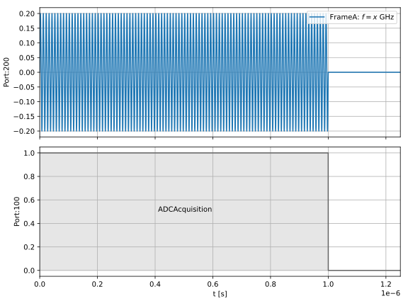

# Resonator Spectroscopy

In this example we perform a resonator spectroscopy experiment, in particular it showcases how the `DetuneFrame` and `Demodulate` operations can be used to sweep the IF of the spectroscopic tone.
* We iterate over the frequency of a 1us readout tone from 6 GHz to 7 GHz in 10 MHz steps.
* At each iteration, the `Frame` of the readout tone is updated with the `DetuneFrame` instruction. This is the same `Frame` used as the reference in the `Demodulate` expression, so that any changes to the IF are also applied to the demodulation.
* To get some statistics we repeat each step of the program 1000 times with an inner for loop.
* Each set of 1000 repetitions are averaged before they are returned to the user.

### Example schedule



### Tree format:

```mermaid
graph TD
    NumericExpression1["6000000000"]
    NumericExpression2["7000000000"]
    NumericExpression3["10000000"]
    NumericRange1["SteppedRange"]
    NumericRange1 -- "InclusiveStart" --- NumericExpression1
    NumericRange1 -- "Step" --- NumericExpression2
    NumericRange1 -- "ExclusiveEnd" --- NumericExpression3
    NumericParameter1["NumericParameter"]
    NumericExpression4["0"]
    NumericExpression5["1"]
    NumericExpression6["1000"]
    NumericRange2["SteppedRange"]
    NumericRange2 -- "InclusiveStart" --- NumericExpression4
    NumericRange2 -- "Step" --- NumericExpression5
    NumericRange2 -- "ExclusiveEnd" --- NumericExpression6
    NumericParameter2["NumericParameter"]
    NumericExpression7["200"]
    Port1["Port"]
    Port1 -- "Id" --- NumericExpression7
    Frequency1["7 GHz"]
    Radians2["0 rad"]
    Frequency3["20 MHz"]
    Frame1["Frame"]
    Frame1 -- "Port" --- Port1
    Frame1 -- "Frequency" --- Frequency1
    Frame1 -- "Phase" --- Radians2
    Frame1 -- "IntermediateFrequency" --- Frequency3
    Hertz4["Hertz"]
    Hertz4 -- "Value" --- NumericParameter1
    Interval5["1 μs"]
    Waveform1["ConstantWaveform"]
    Waveform1 -- "Duration" --- Interval5
    Instruction6["ModulatedPulse"]
    Instruction6 -- "Frame" --- Frame1
    Instruction6 -- "Envelope" --- Waveform1
    NumericExpression8["0.2"]
    Amplitude6["Amplitude"]
    Amplitude6 -- "Value" --- NumericExpression8
    Instruction6 -- "Amplitude" --- Amplitude6
    NumericExpression9["300"]
    Port2["Port"]
    Port2 -- "Id" --- NumericExpression9
    Interval7["1 μs"]
    ComplexRangeExpression1["AcquisitionComplexRangeResult"]
    Instruction7["AdcAcquisition"]
    Instruction7 -- "Port" --- Port2
    Instruction7 -- "Duration" --- Interval7
    Instruction7 -- "Result" --- ComplexRangeExpression1
    Instruction8:Alignment["StartToStart"]
    Instruction8:Relationship["InstructionRelationship"]
    Instruction8:Relationship -- "Alignment" --- Instruction8:Alignment
    Instruction8["Dependency"]
    Instruction8 -- "Relationship" --- Instruction8:Relationship
    Instruction8 -- "Lhs" --- Instruction6
    Instruction8 -- "Rhs" --- Instruction7
    ComplexRangeExpression2["Demodulation"]
    ComplexRangeExpression2 -- "Frame" --- Frame1
    ComplexRangeExpression2 -- "Trace" --- ComplexRangeExpression1
    ComplexRangeExpression3:Values["(0, 1), (2, 3), (4, 5), ..., (1998, 1999)"]
    ComplexRangeExpression3["LiteralComplexRange"]
    ComplexRangeExpression3 -- "Values" --- ComplexRangeExpression3:Values
    ComplexExpression1["ComplexDotProduct"]
    ComplexExpression1 -- "Lhs" --- ComplexRangeExpression2
    ComplexExpression1 -- "Rhs" --- ComplexRangeExpression3
    ComplexRangeRegister1["ComplexRangeRegister"]
    Instruction9["ComplexAppend"]
    Instruction9 -- "Input" --- ComplexExpression1
    Instruction9 -- "Output" --- ComplexRangeRegister1
    Instruction10:Alignment["EndToStart"]
    Instruction10:Relationship["InstructionRelationship"]
    Instruction10:Relationship -- "Alignment" --- Instruction10:Alignment
    Instruction10["Dependency"]
    Instruction10 -- "Relationship" --- Instruction10:Relationship
    Instruction10 -- "Lhs" --- Instruction8
    Instruction10 -- "Rhs" --- Instruction9
    Instruction11["DetuneFrame"]
    Instruction11 -- "Frame" --- Frame1
    Instruction11 -- "Detuning" --- Hertz4
    Instruction11 -- "PhaseReference" --- T0IsJobStart
    Instruction11 -- "Scope1" --- Instruction10
    Instruction12:Alignment["EndToStart"]
    Instruction12:Relationship["InstructionRelationship"]
    Instruction12:Relationship -- "Alignment" --- Instruction12:Alignment
    Function13["Function"]
    Function13 -- "Parameter" --- NumericParameter2
    Function13 -- "Body1" --- Instruction11
    Instruction12["ForEachNumeric"]
    Instruction12 -- "Source" --- NumericRange2
    Instruction12 -- "Relationship" --- Instruction12:Relationship
    Instruction12 -- "Body" --- Function13
    Instruction14:Alignment["EndToStart"]
    Instruction14:Relationship["InstructionRelationship"]
    Instruction14:Relationship -- "Alignment" --- Instruction14:Alignment
    Function15["Function"]
    Function15 -- "Parameter" --- NumericParameter1
    Function15 -- "Body1" --- Instruction12
    Instruction14["ForEachNumeric"]
    Instruction14 -- "Source" --- NumericRange1
    Instruction14 -- "Relationship" --- Instruction14:Relationship
    Instruction14 -- "Body" --- Function15
    ComplexRangeExpression4:BufferDimensions["100, 1000"]
    ComplexRangeExpression4["ComplexAverageOver"]
    ComplexRangeExpression4 -- "Source" --- ComplexRangeRegister1
    ComplexRangeExpression4 -- "BufferDimensions" --- ComplexRangeExpression4:BufferDimensions
    ComplexRangeExpression4 -- "AveragingAxis" --- 1
    ComplexRangeRegister2["ComplexRangeRegister"]
    Instruction16["ComplexAssign"]
    Instruction16 -- "Input" --- ComplexRangeExpression4
    Instruction16 -- "Output" --- ComplexRangeRegister2
    Instruction17:Alignment["EndToStart"]
    Instruction17:Relationship["InstructionRelationship"]
    Instruction17:Relationship -- "Alignment" --- Instruction17:Alignment
    Instruction17["Dependency"]
    Instruction17 -- "Relationship" --- Instruction17:Relationship
    Instruction17 -- "Lhs" --- Instruction14
    Instruction17 -- "Rhs" --- Instruction16
    Job:ComplexRangeOutputs["ComplexRangeOutputs"]
    Job:ComplexRangeOutputs -- "0" --- ComplexRangeRegister2
    Job["Job"]
    Job -- "EntryPoint1" --- Instruction17
    Job -- "ComplexRangeOutputs" --- Job:ComplexRangeOutputs
```


### JSON format:
<details>
<summary>Job definition</summary>

``` JSON
{
    "version": "0.1.0",
    "compatible_version": "0.1.0",
    "complex_range_registers": {
        "ComplexRangeRegister1": {
            "output_name": null
        },
        "ComplexRangeRegister2": {
            "output_name": "demodulated_values"
        }
    },
    "numeric_parameters": {
        "NumericParameter1": {}
    },
    "acquisition_complex_range_results": {
        "AcquisitionComplexRangeResult1": {}
    },
    "frames": {
        "Frame1": {
            "port": {
                "id": {
                    "$type": "NumericLiteral",
                    "value": 200
                }
            },
            "frequency": {
                "$type": "NumericLiteral",
                "value": 7000000000
            },
            "phase": {
                "$type": "NumericLiteral",
                "value": 0
            },
            "intermediate_frequency": {
                "$type": "NumericLiteral",
                "value": 20000000
            }
        }
    },
    "entry_point": [
        {
            "$type": "Dependency",
            "relationship": {},
            "lhs": {
                "$type": "ForEachNumeric",
                "source": {
                    "$type": "SteppedRange",
                    "inclusive_start": {
                        "$type": "NumericLiteral",
                        "value": 6000000000
                    },
                    "step": {
                        "$type": "NumericLiteral",
                        "value": 7000000000
                    },
                    "exclusive_end": {
                        "$type": "NumericLiteral",
                        "value": 10000000
                    }
                },
                "relationship": {},
                "body_name": null,
                "parameter": {
                    "$ref": "NumericParameter1"
                },
                "body_content": [
                    {
                        "$type": "ForEachNumeric",
                        "source": {
                            "$type": "SteppedRange",
                            "inclusive_start": {
                                "$type": "NumericLiteral",
                                "value": 0
                            },
                            "step": {
                                "$type": "NumericLiteral",
                                "value": 1
                            },
                            "exclusive_end": {
                                "$type": "NumericLiteral",
                                "value": 1000
                            }
                        },
                        "relationship": {},
                        "body_name": null,
                        "parameter": {},
                        "body_content": [
                            {
                                "$type": "DetuneFrame",
                                "frame": {
                                    "$ref": "Frame1"
                                },
                                "detuning": {
                                    "$type": "NumericParameter",
                                    "$ref": "NumericParameter1"
                                },
                                "scope": [
                                    {
                                        "$type": "Dependency",
                                        "relationship": {},
                                        "lhs": {
                                            "$type": "Dependency",
                                            "relationship": {
                                                "alignment": "StartToStart"
                                            },
                                            "lhs": {
                                                "$type": "ModulatedPulse",
                                                "frame": {
                                                    "$ref": "Frame1"
                                                },
                                                "envelope": {
                                                    "$type": "ConstantWaveform",
                                                    "duration": {
                                                        "$type": "NumericLiteral",
                                                        "value": 1E-06
                                                    }
                                                },
                                                "phase_offset": {
                                                    "$type": "NumericLiteral",
                                                    "value": 0
                                                },
                                                "amplitude": {
                                                    "$type": "NumericLiteral",
                                                    "value": 0.2
                                                }
                                            },
                                            "rhs": {
                                                "$type": "AdcAcquisition",
                                                "port": {
                                                    "id": {
                                                        "$type": "NumericLiteral",
                                                        "value": 300
                                                    }
                                                },
                                                "duration": {
                                                    "$type": "NumericLiteral",
                                                    "value": 1E-06
                                                },
                                                "result": {
                                                    "$ref": "AcquisitionComplexRangeResult1"
                                                }
                                            }
                                        },
                                        "rhs": {
                                            "$type": "ComplexAppend",
                                            "input": {
                                                "$type": "ComplexDotProduct",
                                                "lhs": {
                                                    "$type": "Demodulation",
                                                    "frame": {
                                                        "$ref": "Frame1"
                                                    },
                                                    "trace": {
                                                        "$ref": "AcquisitionComplexRangeResult1"
                                                    }
                                                },
                                                "rhs": {
                                                    "$type": "LiteralComplexRange",
                                                    "values": [
                                                        [
                                                            0,
                                                            1
                                                        ],
                                                        [
                                                            2,
                                                            3
                                                        ],
                                                        [
                                                            1998,
                                                            1999
                                                        ]
                                                    ]
                                                }
                                            },
                                            "output": {
                                                "$ref": "ComplexRangeRegister1"
                                            }
                                        }
                                    }
                                ],
                                "phase_reference": "T0IsJobStart"
                            }
                        ]
                    }
                ]
            },
            "rhs": {
                "$type": "ComplexRangeAssign",
                "input": {
                    "$type": "ComplexAverageOver",
                    "source": {
                        "$type": "ComplexRangeRegister",
                        "$ref": "ComplexRangeRegister1"
                    },
                    "buffer_dimensions": [
                        100,
                        1000
                    ],
                    "averaging_axis": 1
                },
                "output": {
                    "$ref": "ComplexRangeRegister2"
                }
            }
        }
    ]
}
```
</details>

<details>
<summary>Example results</summary>

``` JSON
{
    "version": "0.1.0",
    "compatible_version": "0.1.0",
    "complex_range_results": [
        {
            "name": "demodulated_values",
            "value": [[4, 0], [5, 0.2], [9, 103], ...]
        }
    ]
}
```
</details>