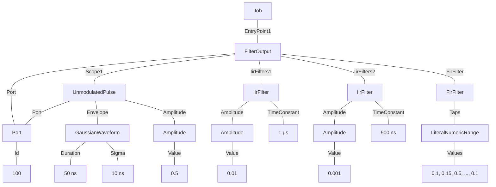

# Using Output Filters

This example shows how IIR and FIR output filters can be applied to ports, for e.g. flux pulse distortion correction. In particular, two IIR filters and an FIR filter are applied to Port 100 with the `FilterOutput` Instruction.

### Tree format:


### JSON format:
<details>
<summary>Job definition</summary>

``` JSON
{
    "version": "0.1.0",
    "compatible_version": "0.1.0",
    "ports": {
        "Port1": {
            "id": {
                "$type": "NumericLiteral",
                "value": 100
            }
        }
    },
    "entry_point": [
        {
            "$type": "FilterOutput",
            "port": {
                "$ref": "Port1"
            },
            "scope": [
                {
                    "$type": "UnmodulatedPulse",
                    "port": {
                        "$ref": "Port1"
                    },
                    "envelope": {
                        "$type": "GaussianWaveform",
                        "duration": {
                            "$type": "NumericLiteral",
                            "value": 5E-08
                        },
                        "sigma": {
                            "$type": "NumericLiteral",
                            "value": 1E-08
                        }
                    },
                    "amplitude": {
                        "$type": "NumericLiteral",
                        "value": 0.5
                    }
                }
            ],
            "iir_filters": [
                {
                    "amplitude": {
                        "$type": "NumericLiteral",
                        "value": 0.01
                    },
                    "time_constant": {
                        "$type": "NumericLiteral",
                        "value": 1E-06
                    }
                },
                {
                    "amplitude": {
                        "$type": "NumericLiteral",
                        "value": 0.001
                    },
                    "time_constant": {
                        "$type": "NumericLiteral",
                        "value": 5E-07
                    }
                }
            ],
            "fir_filter": {
                "taps": {
                    "values": [
                        0.1,
                        0.15,
                        0.5,
                        0.15,
                        0.1
                    ]
                }
            }
        }
    ]
}
```
</details>
