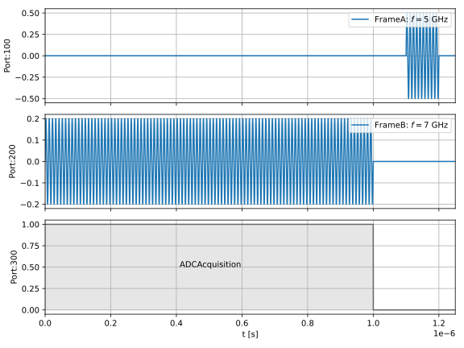
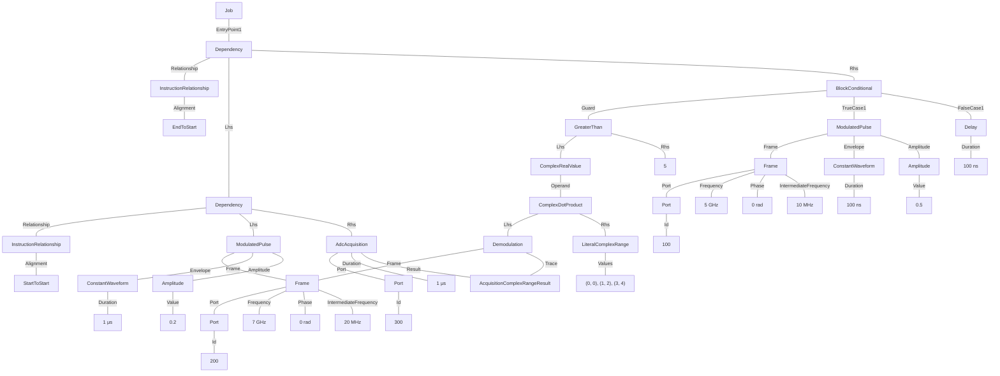

# Active Qubit Reset
This example demonstrates active qubit reset, in which a qubit is first readout and then a pi-pulse is applied conditionally on whether the qubit was found in the |1> state. The `BlockConditional` instruction provides the conditional branching.

### Example schedule


### Tree format:


### JSON format:
<details>
<summary>Job definition</summary>

``` JSON
{
    "version": "0.1.0",
    "compatible_version": "0.1.0",
    "acquisition_complex_range_results": {
        "AcquisitionComplexRangeResult1": {}
    },
    "frames": {
        "Frame1": {
            "port": {
                "id": {
                    "$type": "NumericLiteral",
                    "value": 200
                }
            },
            "frequency": {
                "$type": "NumericLiteral",
                "value": 7000000000
            },
            "phase": {
                "$type": "NumericLiteral",
                "value": 0
            },
            "intermediate_frequency": {
                "$type": "NumericLiteral",
                "value": 20000000
            }
        }
    },
    "entry_point": [
        {
            "$type": "Dependency",
            "relationship": {},
            "lhs": {
                "$type": "Dependency",
                "relationship": {
                    "alignment": "StartToStart"
                },
                "lhs": {
                    "$type": "ModulatedPulse",
                    "frame": {
                        "$ref": "Frame1"
                    },
                    "envelope": {
                        "$type": "ConstantWaveform",
                        "duration": {
                            "$type": "NumericLiteral",
                            "value": 1E-06
                        }
                    },
                    "phase_offset": {
                        "$type": "NumericLiteral",
                        "value": 0
                    },
                    "amplitude": {
                        "$type": "NumericLiteral",
                        "value": 0.2
                    }
                },
                "rhs": {
                    "$type": "AdcAcquisition",
                    "port": {
                        "id": {
                            "$type": "NumericLiteral",
                            "value": 300
                        }
                    },
                    "duration": {
                        "$type": "NumericLiteral",
                        "value": 1E-06
                    },
                    "result": {
                        "$ref": "AcquisitionComplexRangeResult1"
                    }
                }
            },
            "rhs": {
                "$type": "BlockConditional",
                "guard": {
                    "$type": "ComparisonOperation",
                    "operator": "GreaterThan",
                    "lhs": {
                        "$type": "ComplexRealValue",
                        "operand": {
                            "$type": "ComplexDotProduct",
                            "lhs": {
                                "$type": "Demodulation",
                                "frame": {
                                    "$ref": "Frame1"
                                },
                                "trace": {
                                    "$ref": "AcquisitionComplexRangeResult1"
                                }
                            },
                            "rhs": {
                                "$type": "LiteralComplexRange",
                                "values": [
                                    [
                                        0,
                                        0
                                    ],
                                    [
                                        1,
                                        2
                                    ],
                                    [
                                        3,
                                        4
                                    ]
                                ]
                            }
                        }
                    },
                    "rhs": {
                        "$type": "NumericLiteral",
                        "value": 5
                    }
                },
                "true_case": [
                    {
                        "$type": "ModulatedPulse",
                        "frame": {
                            "port": {
                                "id": {
                                    "$type": "NumericLiteral",
                                    "value": 100
                                }
                            },
                            "frequency": {
                                "$type": "NumericLiteral",
                                "value": 5000000000
                            },
                            "phase": {
                                "$type": "NumericLiteral",
                                "value": 0
                            },
                            "intermediate_frequency": {
                                "$type": "NumericLiteral",
                                "value": 10000000
                            }
                        },
                        "envelope": {
                            "$type": "ConstantWaveform",
                            "duration": {
                                "$type": "NumericLiteral",
                                "value": 1E-07
                            }
                        },
                        "phase_offset": {
                            "$type": "NumericLiteral",
                            "value": 0
                        },
                        "amplitude": {
                            "$type": "NumericLiteral",
                            "value": 0.5
                        }
                    }
                ],
                "false_case": [
                    {
                        "$type": "Delay",
                        "duration": {
                            "$type": "NumericLiteral",
                            "value": 1E-07
                        }
                    }
                ]
            }
        }
    ]
}
```
</details>
