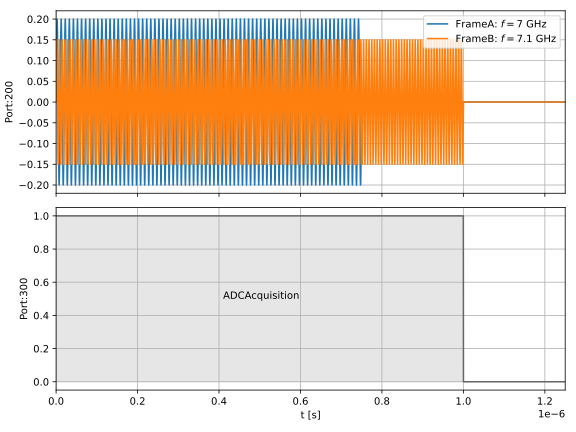

# Multiplexed Readout
This example demonstrates two-qubit readout using resonators that share both a drive line Port and an acquisition Port.

### Example schedule


### Tree format:

```mermaid
graph TD
    NumericExpression1["200"]
    Port1["Port"]
    Port1 -- "Id" --- NumericExpression1
    Frequency1["7 GHz"]
    Radians2["0 rad"]
    Frequency3["20 MHz"]
    Frame1["Frame"]
    Frame1 -- "Port" --- Port1
    Frame1 -- "Frequency" --- Frequency1
    Frame1 -- "Phase" --- Radians2
    Frame1 -- "IntermediateFrequency" --- Frequency3
    Interval4["750 ns"]
    Waveform1["ConstantWaveform"]
    Waveform1 -- "Duration" --- Interval4
    Instruction4["ModulatedPulse"]
    Instruction4 -- "Frame" --- Frame1
    Instruction4 -- "Envelope" --- Waveform1
    NumericExpression2["0.2"]
    Amplitude5["Amplitude"]
    Amplitude5 -- "Value" --- NumericExpression2
    Instruction4 -- "Amplitude" --- Amplitude5
    Frequency6["7.1 GHz"]
    Radians7["0 rad"]
    Frequency8["120 MHz"]
    Frame2["Frame"]
    Frame2 -- "Port" --- Port1
    Frame2 -- "Frequency" --- Frequency6
    Frame2 -- "Phase" --- Radians7
    Frame2 -- "IntermediateFrequency" --- Frequency8
    Interval9["1 μs"]
    Waveform2["ConstantWaveform"]
    Waveform2 -- "Duration" --- Interval9
    Instruction5["ModulatedPulse"]
    Instruction5 -- "Frame" --- Frame2
    Instruction5 -- "Envelope" --- Waveform2
    NumericExpression3["0.2"]
    Amplitude10["Amplitude"]
    Amplitude10 -- "Value" --- NumericExpression3
    Instruction5 -- "Amplitude" --- Amplitude10
    Instruction6:Alignment["StartToStart"]
    Instruction6:Relationship["InstructionRelationship"]
    Instruction6:Relationship -- "Alignment" --- Instruction6:Alignment
    Instruction6["Dependency"]
    Instruction6 -- "Relationship" --- Instruction6:Relationship
    Instruction6 -- "Lhs" --- Instruction4
    Instruction6 -- "Rhs" --- Instruction5
    NumericExpression4["300"]
    Port2["Port"]
    Port2 -- "Id" --- NumericExpression4
    Interval11["1 μs"]
    ComplexRangeExpression1["AcquisitionComplexRangeResult"]
    Instruction7["AdcAcquisition"]
    Instruction7 -- "Port" --- Port2
    Instruction7 -- "Duration" --- Interval11
    Instruction7 -- "Result" --- ComplexRangeExpression1
    Instruction8:Alignment["StartToStart"]
    Instruction8:Relationship["InstructionRelationship"]
    Instruction8:Relationship -- "Alignment" --- Instruction8:Alignment
    Instruction8["Dependency"]
    Instruction8 -- "Relationship" --- Instruction8:Relationship
    Instruction8 -- "Lhs" --- Instruction6
    Instruction8 -- "Rhs" --- Instruction7
    ComplexRangeExpression2["Demodulation"]
    ComplexRangeExpression2 -- "Frame" --- Frame1
    ComplexRangeExpression2 -- "Trace" --- ComplexRangeExpression1
    ComplexRangeExpression3:Values["(0, 0), (1, 2), (3, 4)"]
    ComplexRangeExpression3["LiteralComplexRange"]
    ComplexRangeExpression3 -- "Values" --- ComplexRangeExpression3:Values
    ComplexExpression1["ComplexDotProduct"]
    ComplexExpression1 -- "Lhs" --- ComplexRangeExpression2
    ComplexExpression1 -- "Rhs" --- ComplexRangeExpression3
    ComplexRangeRegister1["ComplexRangeRegister"]
    Instruction10["ComplexAppend"]
    Instruction10 -- "Input" --- ComplexExpression1
    Instruction10 -- "Output" --- ComplexRangeRegister1
    ComplexRangeExpression4["Demodulation"]
    ComplexRangeExpression4 -- "Frame" --- Frame2
    ComplexRangeExpression4 -- "Trace" --- ComplexRangeExpression1
    ComplexRangeExpression5:Values["(0, 0), (1, 2), (3, 4)"]
    ComplexRangeExpression5["LiteralComplexRange"]
    ComplexRangeExpression5 -- "Values" --- ComplexRangeExpression5:Values
    ComplexExpression2["ComplexDotProduct"]
    ComplexExpression2 -- "Lhs" --- ComplexRangeExpression4
    ComplexExpression2 -- "Rhs" --- ComplexRangeExpression5
    ComplexRangeRegister2["ComplexRangeRegister"]
    Instruction11["ComplexAppend"]
    Instruction11 -- "Input" --- ComplexExpression2
    Instruction11 -- "Output" --- ComplexRangeRegister2
    Instruction12:Alignment["StartToStart"]
    Instruction12:Relationship["InstructionRelationship"]
    Instruction12:Relationship -- "Alignment" --- Instruction12:Alignment
    Instruction12["Dependency"]
    Instruction12 -- "Relationship" --- Instruction12:Relationship
    Instruction12 -- "Lhs" --- Instruction10
    Instruction12 -- "Rhs" --- Instruction11
    Instruction13:Alignment["EndToStart"]
    Instruction13:Relationship["InstructionRelationship"]
    Instruction13:Relationship -- "Alignment" --- Instruction13:Alignment
    Instruction13["Dependency"]
    Instruction13 -- "Relationship" --- Instruction13:Relationship
    Instruction13 -- "Lhs" --- Instruction8
    Instruction13 -- "Rhs" --- Instruction12
    Job:ComplexRangeOutputs["ComplexRangeOutputs"]
    Job:ComplexRangeOutputs -- "0" --- ComplexRangeRegister1
    Job:ComplexRangeOutputs -- "1" --- ComplexRangeRegister2
    Job["Job"]
    Job -- "EntryPoint1" --- Instruction13
    Job -- "ComplexRangeOutputs" --- Job:ComplexRangeOutputs
```


### JSON format:
<details>
<summary>Job definition</summary>

``` JSON
{
    "version": "0.1.0",
    "compatible_version": "0.1.0",
    "complex_range_registers": {
        "ComplexRangeRegister1": {
            "output_name": "resonator_1"
        },
        "ComplexRangeRegister2": {
            "output_name": "resonator_2"
        }
    },
    "acquisition_complex_range_results": {
        "AcquisitionComplexRangeResult1": {}
    },
    "ports": {
        "Port1": {
            "id": {
                "$type": "NumericLiteral",
                "value": 200
            }
        }
    },
    "frames": {
        "Frame1": {
            "port": {
                "$ref": "Port1"
            },
            "frequency": {
                "$type": "NumericLiteral",
                "value": 7000000000
            },
            "phase": {
                "$type": "NumericLiteral",
                "value": 0
            },
            "intermediate_frequency": {
                "$type": "NumericLiteral",
                "value": 20000000
            }
        },
        "Frame2": {
            "port": {
                "$ref": "Port1"
            },
            "frequency": {
                "$type": "NumericLiteral",
                "value": 7100000000
            },
            "phase": {
                "$type": "NumericLiteral",
                "value": 0
            },
            "intermediate_frequency": {
                "$type": "NumericLiteral",
                "value": 120000000
            }
        }
    },
    "entry_point": [
        {
            "$type": "Dependency",
            "relationship": {},
            "lhs": {
                "$type": "Dependency",
                "relationship": {
                    "alignment": "StartToStart"
                },
                "lhs": {
                    "$type": "Dependency",
                    "relationship": {
                        "alignment": "StartToStart"
                    },
                    "lhs": {
                        "$type": "ModulatedPulse",
                        "frame": {
                            "$ref": "Frame1"
                        },
                        "envelope": {
                            "$type": "ConstantWaveform",
                            "duration": {
                                "$type": "NumericLiteral",
                                "value": 7.5E-07
                            }
                        },
                        "phase_offset": {
                            "$type": "NumericLiteral",
                            "value": 0
                        },
                        "amplitude": {
                            "$type": "NumericLiteral",
                            "value": 0.2
                        }
                    },
                    "rhs": {
                        "$type": "ModulatedPulse",
                        "frame": {
                            "$ref": "Frame2"
                        },
                        "envelope": {
                            "$type": "ConstantWaveform",
                            "duration": {
                                "$type": "NumericLiteral",
                                "value": 1E-06
                            }
                        },
                        "phase_offset": {
                            "$type": "NumericLiteral",
                            "value": 0
                        },
                        "amplitude": {
                            "$type": "NumericLiteral",
                            "value": 0.2
                        }
                    }
                },
                "rhs": {
                    "$type": "AdcAcquisition",
                    "port": {
                        "id": {
                            "$type": "NumericLiteral",
                            "value": 300
                        }
                    },
                    "duration": {
                        "$type": "NumericLiteral",
                        "value": 1E-06
                    },
                    "result": {
                        "$ref": "AcquisitionComplexRangeResult1"
                    }
                }
            },
            "rhs": {
                "$type": "Dependency",
                "relationship": {
                    "alignment": "StartToStart"
                },
                "lhs": {
                    "$type": "ComplexAppend",
                    "input": {
                        "$type": "ComplexDotProduct",
                        "lhs": {
                            "$type": "Demodulation",
                            "frame": {
                                "$ref": "Frame1"
                            },
                            "trace": {
                                "$ref": "AcquisitionComplexRangeResult1"
                            }
                        },
                        "rhs": {
                            "$type": "LiteralComplexRange",
                            "values": [
                                [
                                    0,
                                    0
                                ],
                                [
                                    1,
                                    2
                                ],
                                [
                                    3,
                                    4
                                ]
                            ]
                        }
                    },
                    "output": {
                        "$ref": "ComplexRangeRegister1"
                    }
                },
                "rhs": {
                    "$type": "ComplexAppend",
                    "input": {
                        "$type": "ComplexDotProduct",
                        "lhs": {
                            "$type": "Demodulation",
                            "frame": {
                                "$ref": "Frame2"
                            },
                            "trace": {
                                "$ref": "AcquisitionComplexRangeResult1"
                            }
                        },
                        "rhs": {
                            "$type": "LiteralComplexRange",
                            "values": [
                                [
                                    0,
                                    0
                                ],
                                [
                                    1,
                                    2
                                ],
                                [
                                    3,
                                    4
                                ]
                            ]
                        }
                    },
                    "output": {
                        "$ref": "ComplexRangeRegister2"
                    }
                }
            }
        }
    ]
}
```
</details>

<details>
<summary>Example results</summary>

``` JSON
{
    "version": "0.1.0",
    "compatible_version": "0.1.0",
    "complex_range_results": [
        {
            "name": "resonator_1",
            "value": [[1, 2]]
        },
                {
            "name": "resonator_2",
            "value": [[3, 4]]
        }
    ]
}
```
</details>
