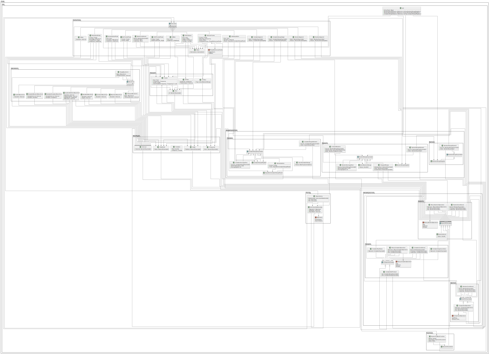

# UML

This folder defines a Job in the OAQ specification, which is the request sent to the server to perform a pulse-schedule job. It takes the form of an Abstract Syntax Graph (ASG) represented here by a UML diagram.

## Class UML diagram
!!! note
    Open image in a new tab to zoom.

## Source
The diagram is generated by the PlantUML files contained in this folder, starting with [include.puml](./include.puml) as the top level file. As it can be difficult to follow relationship edges in the diagram, we provide the source for the user to read.

For more details on what each class and their fields represent, please see the [documentation](../../docs/README.md).
