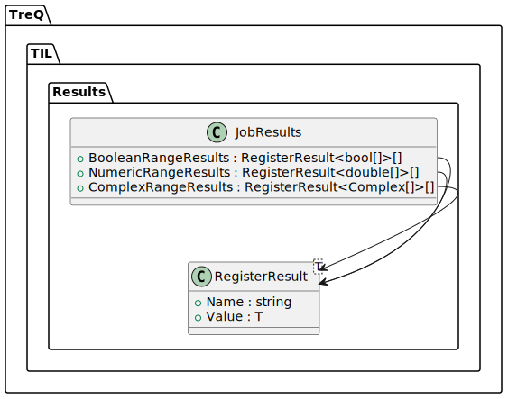

# UML

This folder defines Results in the OAQ specification, which is the response sent by the server to notify a client of the results of running a job. It takes the form of an Abstract Syntax Graph (AST) represented here by a UML diagram.

## Class UML diagram

## Source
The diagram is generated by the PlantUML files contained in this folder, starting with [include.puml](./include.puml) as the top level file.

For more details on what each class and their fields represent, please see the [documentation](../../docs/README.md).
